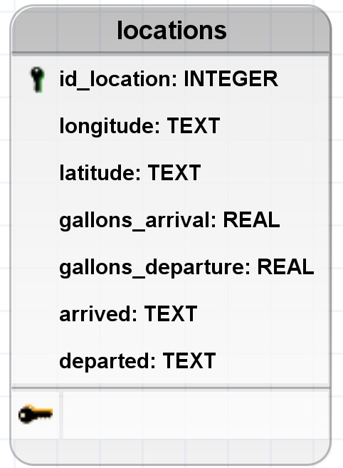
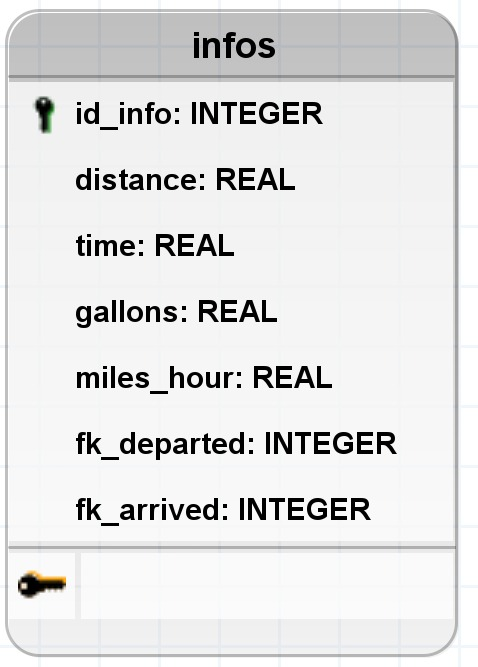

# Data Engineer Challenge

**Antes de mais nada, é necessário criar um ambiente virtual e instalar as dependências de pacotes...**

```bash
# ambiente virtual
python -m venv venv
# dependências de pacotes
pip install -r requirements.txt
```

## Estrutura do projeto

```bash
├── assets # imagens para o readme
├── tests # arquivos de testes
├── utils # arquivos com funções uteis para o programa principal
├── comands.sql.txt # arquivo com os comandos utilizados no sqlite
├── data.ipynb # arquivo principal
├── data.xlxs # base de dados em excel
├── database.db # database em sqlite
├── README.md
└── requeriments.txt # arquivo com nome das dependências de pacotes necessárias
```

---

## Carregamento dos dados

Primeiro criei uma tabela com 7 atributos para armazenar cada campo da tabela do excel, a  **Modelagem de dados** ficou assim:



---

Seguindo utilizando a biblioteca pandas e a classe que criei dentro de `utils/load_db.py` carreguei os dados para o sqlite *(por motivos de simplicidade para disponibilizar o database por ele)*

Após o carregemento desses dados era necessário descobrir como calular distancia por meio da longitude e latitude para isso usei como fonte esse site: [ufrgs](https://cref.if.ufrgs.br/?contact-pergunta=calculo-aproximado-de-distancias-com-base-em-coordenadas-de-latitude-e-longitude). Dentro de `utils/utils.py` criei uma função chamada `distance_miles` que calcula a distancias das longitudes e latitudes de entrada e saida. Também foi necessário calcular a diferença de tempo entre cada coordenada, para isso criei uma outra função dentro de `utils/utils.py` chamada `diff_time` para calcular a diferença em horas da saida e chegada. Depois para calcular a velocidade, dividi a distancia pelo tempo. Calculei a quantidade de galões gastos entre cada ponto, bastando subtrai a quantidade na saida com a quantidade na chegada.

Por fim, carreguei todas essas informações em outra tabela do sqlite, sendo dessa a **Modelagem dos dados**



**OBS: Note que há mais dois campos, `fk_departed` e `fk_arrived`, não relacionados com os calculos acima, eles serão necessários para encontrar as longitudes e latitudes de chegada e partida mais a frente**

---

Concluindo, para achar a média de milhas por galão para o segmento da viagem onde Jim e Pam tiveram a maior velocidade, bastou executar um comando em sql:

```sql
SELECT distance, time, gallons, MAX(miles_hour) FROM infos
```

O comando sql acima traz como resultado com auxílio  da função `search_arrival_depart` dentro de `utils/load_infos.py` para encontrar as longitudes e latitudes de chegada e partida

Distance | time | gallons | miles_hour | longitude_arrived | latitude_arrived | longitude_departed | latitude_departed
:---: | :---: | :--- | :---: | :---: | :---: | :---: | :---:
152 | 2.35 | 5.1 | 64.70 | -82.122803 | 41.393294 | -80.837402 | 41.393294

Este comando traz a tupla onde a velocidade foi a maior calculada, bastando apenas dividir a distancia pelos galões gastos

`152 / 5.1 ~= 29.81`

Ou seja/ se aproximando mais da letra D: `29.79 miles per gallon`
